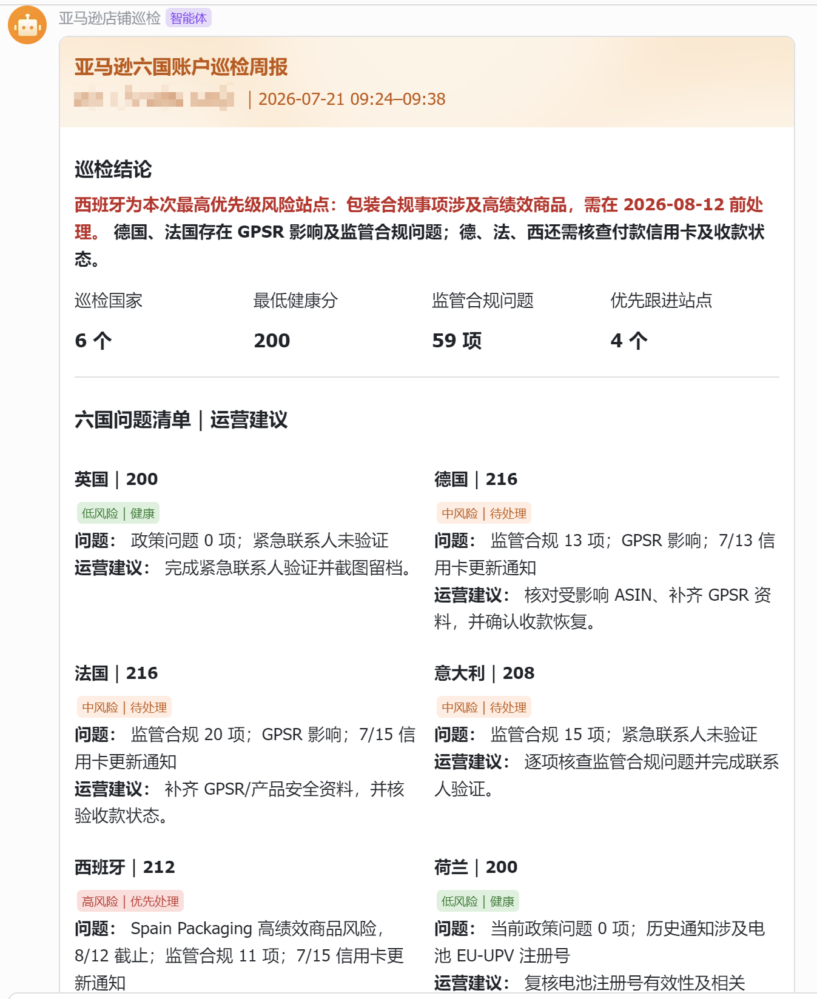

<div align="center">
  
  <h1>blues19-amazon-account-patrol</h1>
  <p>通过紫鸟店铺现有浏览器会话，对 Amazon Seller Central 执行可验证、只读的账号健康与绩效通知巡检。</p>
</div>

## 能做什么

- 巡检 Amazon Seller Central 的账号健康和绩效通知页面。
- 覆盖美国、加拿大、墨西哥、英国、德国、法国、意大利、西班牙和荷兰 9 个市场。
- 验证当前工作台国家、域名或 Marketplace ID，避免巡检错站点。
- 保存实际页面 URL、页面原文、截图路径、Markdown 记录和运行日志。
- 默认只保存到本地；只有用户明确要求时才发送到飞书。

> 本 Skill 的主体是 `blues19-amazon-account-patrol`；[`ziniao-cli`](https://open.ziniao.com/ziniaoCli) 是连接紫鸟浏览器店铺会话的必需运行环境。**请先安装并验证 ziniao-cli，再安装本 Skill。**

## 使用顺序

1. 安装 Node.js 16+ 与 `ziniao-cli`。
2. 确认当前使用 BOSS 账号还是成员账号，再完成 CLI 应用创建与授权。
3. 成员创建的 CLI 应用由 BOSS 审核通过后，再用 `doctor`、`config show` 和 `store list` 验证。
4. 安装 `blues19-amazon-account-patrol`。
5. 确认 Python 3.10+，再选择店铺与市场运行巡检。

## 第一步：准备 ziniao-cli 环境

需要紫鸟浏览器客户端、可访问的目标店铺，以及 Node.js 16 或更高版本。Windows PowerShell：

```powershell
node -v
npm.cmd install -g @ziniao-open/cli
ziniao-cli.cmd --version
ziniao-cli.cmd config init --new
ziniao-cli.cmd doctor
ziniao-cli.cmd config show
ziniao-cli.cmd store list --format table
```

如果已经安装 CLI，可以跳过全局安装，但仍需完成初始化、诊断、当前配置和店铺可见性检查。全局安装和授权会修改本机配置；如果让智能体执行，应先取得用户批准，授权链接必须由用户本人在浏览器中完成。

### 先分清：BOSS 账号与成员账号

| 账号 | 都可以做什么 | 关键区别 |
| --- | --- | --- |
| BOSS 账号 | 自行创建紫鸟 CLI 应用 | 填写应用名称、勾选所需权限并提交后即可创建；同时负责在开放平台的“应用审核”中审核成员创建的 CLI 应用。 |
| 成员账号 | 自行创建紫鸟 CLI 应用 | 通过初始化产生的授权链接登录后，系统自动创建应用；必须由 BOSS 审核通过，应用才会生效。 |

初始化前，紫鸟客户端与开放平台必须登录准备使用 CLI 的同一账号。第一台设备会自动添加本机终端；换电脑或新增设备时，要在对应 CLI 应用的“设置 → 终端管理”中绑定终端识别码。

> CLI 应用审核与店铺授权是两层权限。应用审核通过，不代表成员自动获得全部店铺。若 `store list` 看不到目标店铺，应停止巡检，请 BOSS 或有权限的管理员在成员管理中补充目标店铺授权，再重新验证。本巡检只需要目标店铺的浏览器只读访问，不需要扩大为企业管理权限。

学员可直接阅读紫鸟官方的 [CLI 创建应用和授权流程](https://open.ziniao.com/docSupport?docId=281#%E4%B8%80%E3%80%81%E5%89%8D%E7%BD%AE%E9%80%9A%E7%94%A8%E5%BF%85%E5%81%9A%E4%BA%8B%E9%A1%B9%EF%BC%88%E6%93%8D%E4%BD%9C%E5%89%8D%E4%BC%98%E5%85%88%E6%89%A7%E8%A1%8C%EF%BC%890) 和 [成员店铺授权说明](https://www.ziniao.com/help/docs/team/17363304414278)。

完整步骤见 [环境安装与配置](references/setup.md)。

## 第二步：安装本 Skill

ziniao-cli 环境验证通过后，再安装 Skill。

Windows PowerShell：

```powershell
npx.cmd skills add ivan51769/blues19-amazon-account-patrol -y
```

macOS / Linux：

```bash
npx skills add ivan51769/blues19-amazon-account-patrol -y
```

也可以把下面这句话直接发给智能体：

> 请协助我安装 `blues19-amazon-account-patrol`。先按紫鸟官方文档检查 Node.js 16+ 并准备 `ziniao-cli`；初始化前先问清我是 BOSS 账号还是成员账号。两种账号都能创建 CLI 应用，但成员创建后必须暂停并提醒我让 BOSS 在开放平台完成应用审核。授权链接由我本人打开，不要接收密码、OTP 或密钥；确认紫鸟客户端与开放平台登录的是同一账号，并以 `doctor`、`config show` 和 `store list` 验证。若目标店铺不可见，停止并请 BOSS 或有权限的管理员授权，不要扩大权限。环境通过后，从 https://github.com/ivan51769/blues19-amazon-account-patrol 安装完整 Skill，安装名称必须是 `blues19-amazon-account-patrol`，保留 `SKILL.md`、`agents`、`scripts`、`references`、`assets` 和 `tests`，最后验证 Python 3.10+、脚本 `--help` 与全部测试。默认只配置本地输出，暂不接入飞书。

### 可选：让 Codex 协助接入飞书

本仓库直接调用飞书企业自建应用 OpenAPI，不把 `lark-cli`、飞书插件或群自定义机器人 Webhook 当作必需环境。先让本地巡检运行成功，再决定是否启用飞书。

把下面这句话发给 Codex：

> 请协助我为 `blues19-amazon-account-patrol` 配置可选飞书推送。先确认本地巡检已能运行；说明这套推送使用飞书企业自建应用 OpenAPI。指导我在飞书开发者后台创建或检查自建应用、开启机器人能力、申请“以应用身份发消息”和“获取与上传图片或文件资源”所需的最小权限、发布版本，并把机器人加入我确认的目标群。App ID、App Secret 只由我本人在本机 PowerShell 环境变量中填写，不粘贴到对话、源码或日志；检查时不得回显值。确认群聊 ID 与测试内容后，必须再次取得我的明确批准才能发送测试。只有接口返回 `code = 0` 且 `message_ids` 非空时，才能报告 API 已受理，并提醒我到群内确认实际可见。

详细步骤见 [环境安装与配置：可选飞书推送](references/setup.md#可选飞书推送)。

## 第三步：运行巡检

巡检脚本要求 Python 3.10 或更高版本，并且只使用标准库。

先查询当前成员可见的店铺：

```powershell
ziniao-cli.cmd store list --format table
```

巡检单个市场：

```powershell
python scripts\amazon_account_patrol.py `
  --store-id <ziniao-store-id> `
  --marketplace us
```

巡检全部 9 个市场：

```powershell
python scripts\amazon_account_patrol.py `
  --store-id <ziniao-store-id> `
  --all-marketplaces
```

支持的市场代码：

| 区域 | 市场代码 |
| --- | --- |
| 北美 | `us`、`ca`、`mx` |
| 欧洲 | `uk`、`de`、`fr`、`it`、`es`、`nl` |

在支持 Skill 的智能体中，也可以直接说：

> 使用 `$blues19-amazon-account-patrol` 对我指定的店铺执行美国站只读巡检，只保存本地记录，不发送飞书；先确认店铺 ID 和市场，缺少必要信息时停止并告诉我。

## 效果预览

<div align="center">
  <a href="assets/patrol-report-example.png">
    
  </a>
</div>

> 这是历史六国巡检周报的脱敏效果示例，仅用于展示报告形态；当前 Skill 已扩展到九个市场，实际结果以本次巡检采集的证据为准。

## 安全边界

- 只复用目标紫鸟店铺已有会话和自动填充，不接收或保存 Amazon 密码、OTP。
- 不修改商品、价格、库存、广告、账号设置、Case、政策或通知。
- 不在仓库中写入店铺 ID、收件人、时区、个人路径或任何密钥。
- `amazon-patrol-output/`、日志、`.env` 和缓存已排除在 Git 提交之外。
- 页面原文、截图和巡检记录可能包含店铺敏感信息，应存放在用户批准的私有位置。

## 使用指引与技术资料

- [PDF 纵向新手使用指引](output/pdf/blues19-amazon-account-patrol-店铺巡检使用指引-拾玖说跨境AI.pdf)：A4 纵向、全部章节连续展开；从打开 PowerShell 开始，按“ziniao-cli → 账号与权限 → Skill → 巡检 → 可选飞书”逐步讲解，并包含脱敏周报截图、浅水印和联系二维码。
- [HTML 图文使用指引](blues19-amazon-account-patrol-使用指引.html)：周报示例、公众号二维码和个人微信二维码均已内嵌，单独下载这个 HTML 也能完整显示；页面带轻量彩色描边水印，并保留主题切换和复制按钮。
- [环境安装与配置](references/setup.md)：Python、Node.js、`ziniao-cli`、授权和店铺可见性检查。
- [巡检执行流程](references/workflow.md)：状态机、证据标准和重试边界。
- [市场映射](references/marketplace-label-map.md)：9 个市场的公开标识。
- [页面选择器](references/element_selectors.md)：Seller Central 页面定位参考。
- [紫鸟 CLI 官方入口](https://open.ziniao.com/ziniaoCli)：CLI 安装、能力和官方业务案例。
- [紫鸟 CLI 创建应用和授权流程](https://open.ziniao.com/docSupport?docId=281#%E4%B8%80%E3%80%81%E5%89%8D%E7%BD%AE%E9%80%9A%E7%94%A8%E5%BF%85%E5%81%9A%E4%BA%8B%E9%A1%B9%EF%BC%88%E6%93%8D%E4%BD%9C%E5%89%8D%E4%BC%98%E5%85%88%E6%89%A7%E8%A1%8C%EF%BC%890)：BOSS/成员创建应用、审核、终端绑定与安装后校验。
- [飞书发送消息 API](https://open.feishu.cn/document/server-docs/im-v1/message/create?lang=zh-CN)与[上传图片 API](https://open.feishu.cn/document/server-docs/im-v1/image/create?lang=zh-CN)：可选飞书推送的官方权限和前置条件。

安装官方紫鸟 Skills 后，还可以围绕员工授权、网页访问策略、差评响应、运营报告、Listing 维护、库存巡检和批量截图等场景制作独立 Skill。本仓库只内置 Amazon 账号健康与绩效通知的只读巡检，不代表已包含上述扩展功能。

## 项目结构

```text
blues19-amazon-account-patrol/
├─ SKILL.md
├─ agents/openai.yaml
├─ scripts/amazon_account_patrol.py
├─ references/
├─ tests/
├─ assets/
│  ├─ wechat-logo.jpg
│  ├─ wechat-official-account-qr.png
│  ├─ wechat-personal-qr.png
│  └─ patrol-report-example.png
├─ output/pdf/
│  └─ blues19-amazon-account-patrol-店铺巡检使用指引-拾玖说跨境AI.pdf
└─ blues19-amazon-account-patrol-使用指引.html
```

公众号：**拾玖说跨境AI**
